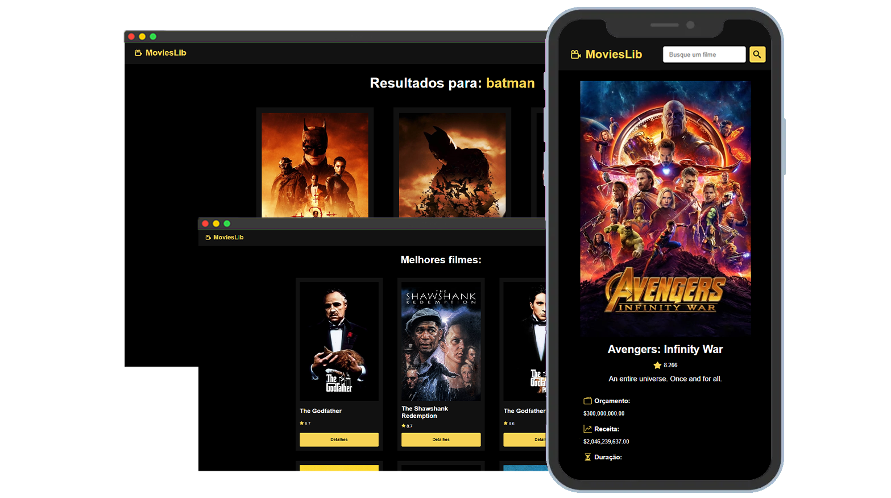

<h1 align="center">Filmes Explorer</h1>

  <a href="#-hospedagem">Hospedagem</a>&nbsp;&nbsp;&nbsp;|&nbsp;&nbsp;&nbsp;
  <a href="#-tecnologias">Tecnologias</a>&nbsp;&nbsp;&nbsp;|&nbsp;&nbsp;&nbsp;
  <a href="#-projeto">Projeto</a>&nbsp;&nbsp;&nbsp;|&nbsp;&nbsp;&nbsp;
  <a href="#-layout">Layout</a>&nbsp;&nbsp;&nbsp;|&nbsp;&nbsp;&nbsp;
  <a href="#-licença">Licença</a>&nbsp;&nbsp;&nbsp;

 

## ☆ Hospedagem
- Acesse o link abaixo e veja o código hospedado online. 
https://movieslib-krd.vercel.app

## ☆ Tecnologias
- HTML
- CSS
- JavaScript
- ReactJS
- Vite
- React Router
- TMDB API

## ☆ Projeto
➜ [Como contribuir?](./read-model/CONTRIBUTING.md)  
➜ [Documentação aprofundada](./read-model/MODEL.md) 

 

Este projeto é uma aplicação para explorar e descobrir filmes, utilizando ReactJS e consumindo a API do TMDB. O aplicativo permite que os usuários busquem por filmes, visualizem detalhes específicos e naveguem entre diferentes páginas.

**Funcionalidades Principais:**
- Busca de Filmes: Os usuários podem pesquisar por filmes utilizando o campo de busca.
- Detalhes do Filme: Os usuários podem clicar em um filme para ver detalhes adicionais, como sinopse, elenco e avaliações.
- Navegação: O aplicativo utiliza React Router para permitir a navegação entre diferentes páginas, como a página inicial e a página de detalhes do filme.

**Estrutura do Projeto:**

- Frontend: Desenvolvido com ReactJS e Vite, o frontend consiste em diferentes componentes para exibir a interface do usuário e interagir com a API do TMDB.
- API do TMDB: Utilizada para obter informações sobre os filmes, incluindo detalhes, imagens e avaliações.

**Uso do Projeto:**
- Os usuários acessam o aplicativo através de um navegador web.
- Eles podem pesquisar por filmes usando o campo de busca.
- Ao clicar em um filme, podem ver detalhes adicionais na página de detalhes do filme.

## ☆ Layout
Obtenha uma perspectiva detalhada do layout do projeto por meio da imagem abaixo.

## ☆ Licença
Esse projeto está sob a [licença MIT](/LICENSE).
